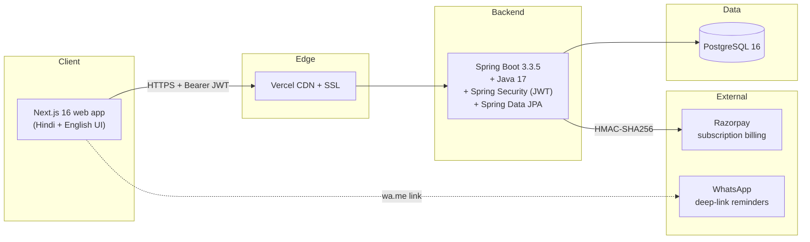

<div align="center">

# AgriDesk

**Smart dukaan management SaaS for Indian agri-input dealers — ₹499/month.**

A Hindi-first digital ledger for fertilizer, pesticide, and seed shop owners.
Tracks farmer credit (udhari), GST-billed sales, stock with expiry alerts,
and WhatsApp payment reminders.

[](https://github.com/satyajeet00/agridesk/actions/workflows/ci.yml)
[](https://github.com/satyajeet00/agridesk/actions/workflows/e2e.yml)
[](https://github.com/satyajeet00/agridesk/actions/workflows/ci.yml)
[](LICENSE)
[](https://spring.io/projects/spring-boot)
[](https://nextjs.org)

</div>

---

## The problem

4M+ Indian agri-input dealers run their shops on paper diaries. Farmers buy
fertilizer, urea, DAP, seeds, and pesticides — often on credit (*udhari*).
A typical dealer extends ₹1–5 lakh of informal credit per month and tracks it
in a notebook. Mistakes, lost diaries, and "bhool gaye" disputes cost them
real money.

Existing software is built for cities, runs in English, and assumes a
chartered accountant. AgriDesk is built for the dealer himself — Hindi UI,
WhatsApp reminders, two-tap workflows, ₹499/month flat.

## What AgriDesk does

- **Farmer-level credit ledger** with running balances, payment history,
  and one-tap WhatsApp reminders.
- **GST-compliant billing** with PDF generation and per-dealer sequential
  bill numbers — atomic stock decrement + farmer-balance update in a single
  transaction.
- **Stock + expiry tracking** — fertilizers and pesticides go bad; the
  dashboard surfaces batches expiring in the next 30 days.
- **Hindi-first UI** with English toggle, designed for shop owners with
  no SaaS experience.
- **Single ₹499/month flat plan**, 14-day free trial, Razorpay-billed.
- **Founding Member pricing**: first 10 dealers get ₹299/month locked for 6 months — used as a controlled beta to validate retention before opening the public price.

## Architecture



Multi-tenancy is enforced at the **service layer** — every authenticated
request resolves the dealer ID from the JWT, and every repository query is
scoped to it. There is no way to read or write another dealer's data, even
with a tampered request body. See `docs/HLD.md` for the full system design.

## Tech stack

| Layer | Choice | Why |
|---|---|---|
| Backend | Spring Boot 3.3.5 + Java 17 | Mature, hireable, deep ecosystem |
| Auth | Spring Security + JWT (jjwt 0.12) | Stateless, simple to deploy multi-instance |
| Persistence | Spring Data JPA + Hibernate | Standard, repository-level scoping for tenancy |
| Dev DB | H2 file-based | Zero install for local dev |
| Prod DB | PostgreSQL 16 | The default safe choice for SaaS |
| API docs | Springdoc OpenAPI 2.6 | Auto-generated Swagger UI at `/api/docs` |
| Payments | Razorpay (HTTP + HMAC verify) | India-first PSP, supports UPI |
| Frontend | Next.js 16 (App Router) + TypeScript | Same team can ship web + later wrap to Capacitor |
| UI | Tailwind 4 + shadcn/ui + Base UI | Premium look without a designer |
| Tests (backend) | JUnit 5 + Spring MockMvc + JaCoCo | Black-box per-controller integration tests |
| Tests (UI) | Playwright + Chromium | Real browser, real backend |
| Tests (HTTP) | PowerShell + Invoke-WebRequest | Live-stack CORS / JWT smoke |

## Tests — current numbers

- **75 backend tests** (JUnit + MockMvc) covering controllers, validation,
  multi-tenant isolation, and Spring Security behavior.
- **24 Playwright UI tests** covering every button, form, dialog, toast,
  and table interaction in the frontend.
- **PowerShell e2e** (`docs/e2e-test.ps1`) for live-stack CORS preflight
  and real-network JWT round-trip.
- **88.9 % line coverage** on the backend (JaCoCo, latest CI run — see the live badge above).
- All three suites are part of CI and gate merges to `main`.

```text
Backend  : mvn -B verify                              # 75 tests, 88.9% coverage
Frontend : npm run test:ui   (in agridesk-web/)       # 24 Playwright tests
Live HTTP: pwsh -File docs/e2e-test.ps1               # against running stack
```

## Live demo

> _Live URLs will be added here once first deploy lands. For now, run locally._

| | URL | Login |
|---|---|---|
| Web app | [coming soon] | `demo@agridesk.in` / `demo123` |
| API docs | [coming soon]/api/docs | (use **Authorize** button with JWT) |
| HLD document | [docs/HLD.md](docs/HLD.md) | |

A 90-second walkthrough is in [`docs/loom-script.md`](docs/loom-script.md);
the recorded video link will be inlined here after Day 3.

## Run locally

### 1. Backend (`agridesk-api`)

```bash
cd agridesk-api
./mvnw spring-boot:run            # or: mvn spring-boot:run
```

The API boots on **`http://127.0.0.1:8080`** with an H2 file DB at
`./data/agridesk` (created on first run). Swagger UI is at
`http://127.0.0.1:8080/api/docs`.

### 2. Frontend (`agridesk-web`)

```bash
cd agridesk-web
npm install
npm run dev -- -p 5501           # explicit port: matches Playwright config
```

The app boots on **`http://127.0.0.1:5501`**. Open it, click *रजिस्टर करें*,
create a dealer, and go.

### 3. Run tests

```bash
# Backend
cd agridesk-api && mvn -B verify

# UI (requires both servers running)
cd agridesk-web && npm run test:ui

# Live-stack HTTP (requires backend running)
pwsh -File docs/e2e-test.ps1
```

## Project structure

```
.
├── agridesk-api/                 Spring Boot 3.3.5 + Java 17 backend
│   ├── src/main/java/com/agridesk/
│   │   ├── controller/           8 REST controllers (Auth, Farmers, Bills, ...)
│   │   ├── service/              Business logic, multi-tenant scoping
│   │   ├── repository/           Spring Data JPA interfaces
│   │   ├── entity/               JPA entities (Dealer, Farmer, Bill, ...)
│   │   ├── dto/                  Request / response records
│   │   ├── security/             JWT filter, CurrentUser, SecurityConfig
│   │   └── config/               OpenApiConfig, GlobalExceptionHandler
│   └── src/test/java/com/agridesk/
│       └── controller/           75 JUnit + MockMvc tests
│
├── agridesk-web/                 Next.js 16 (App Router) + TypeScript
│   ├── src/app/
│   │   ├── (auth)/               login, signup
│   │   └── (dashboard)/dashboard/  farmers, billing, inventory, ledger, settings
│   ├── src/lib/                  api client, session, subscription helpers
│   ├── src/components/           ui/ + dashboard/ + delete-confirm.tsx
│   └── tests-e2e/                24 Playwright tests
│
├── docs/
│   ├── HLD.md                    Full High-Level Design (data model, sequences, test catalog)
│   ├── adr/                      Architectural Decision Records (5)
│   ├── e2e-test.ps1              PowerShell live-stack black-box suite
│   ├── seed-demo.ps1             Seeds a populated demo dealer (5 farmers, 8 products, 3 bills, ledger)
│   └── loom-script.md            90-second demo recording script
│
├── .github/
│   ├── workflows/ci.yml          PR + push: mvn verify + npm build, posts coverage badge
│   ├── workflows/e2e.yml         Nightly + manual: full stack + Playwright
│   └── dependabot.yml            Weekly dep updates, grouped
│
├── LICENSE                       MIT
└── README.md                     (this file)
```

## Deeper reading

- **[`docs/HLD.md`](docs/HLD.md)** — full High-Level Design: context, system
  architecture diagram, ERD, sequence diagrams, multi-tenancy enforcement,
  test scenario catalog (all 100+ scenarios that the three suites implement).
- **[`docs/adr/`](docs/adr/)** — Architectural Decision Records covering
  Spring Boot vs Node, service-layer tenancy, JWT vs sessions, H2 in tests,
  and monorepo vs microservices.

## Roadmap

| Phase | Trigger | Items |
|---|---|---|
| **Beta launch** | First 5 founding dealers on web | Onboard founding members at ₹299/mo for 6 months; collect activation, retention, and "would you pay ₹499" signals (see [HLD §16](docs/HLD.md#16-beta-launch-plan-and-founding-member-pricing)) |
| **Production deploy** | 5 active founders, no critical bugs | Flyway migrations, Spring prod profile, Render + Vercel + managed Postgres, Razorpay webhook, custom domain |
| **Android via Capacitor** | 10+ paying dealers on web | Static-export Next.js, Capacitor Android wrap, Play Store listing — keeps a single codebase between web + APK |
| **Reliability** | 50+ paying dealers | Sentry, structured logging, `/actuator/health` wired to uptime monitor, daily DB backup verification |
| **v1.1 features** | 100+ paying dealers | Gross-profit tracking (data already in `StockBatch.costPrice`), expense module, refresh tokens, soft deletes + audit log |
| **PWA** | Validated demand for offline | Service worker, installable web manifest — runs in parallel with the Capacitor Android app for non-Android users |

## Contributing / forking

MIT licensed. If you fork it for your own SaaS, please rename and remove the
"AgriDesk" trademark; the *code* is free, the *brand* is not.

## Author

[Satyajeet](https://github.com/satyajeet00) — Solo founder and engineer.
Built end-to-end as a real product, not a portfolio toy.
