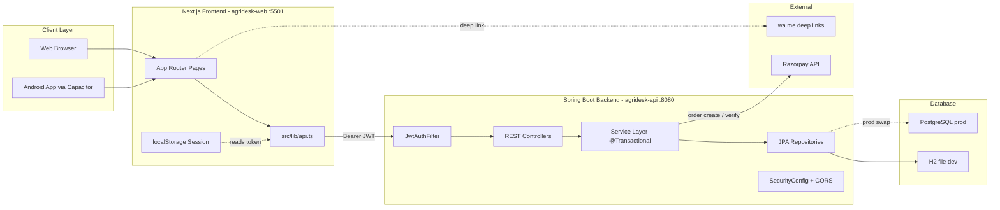
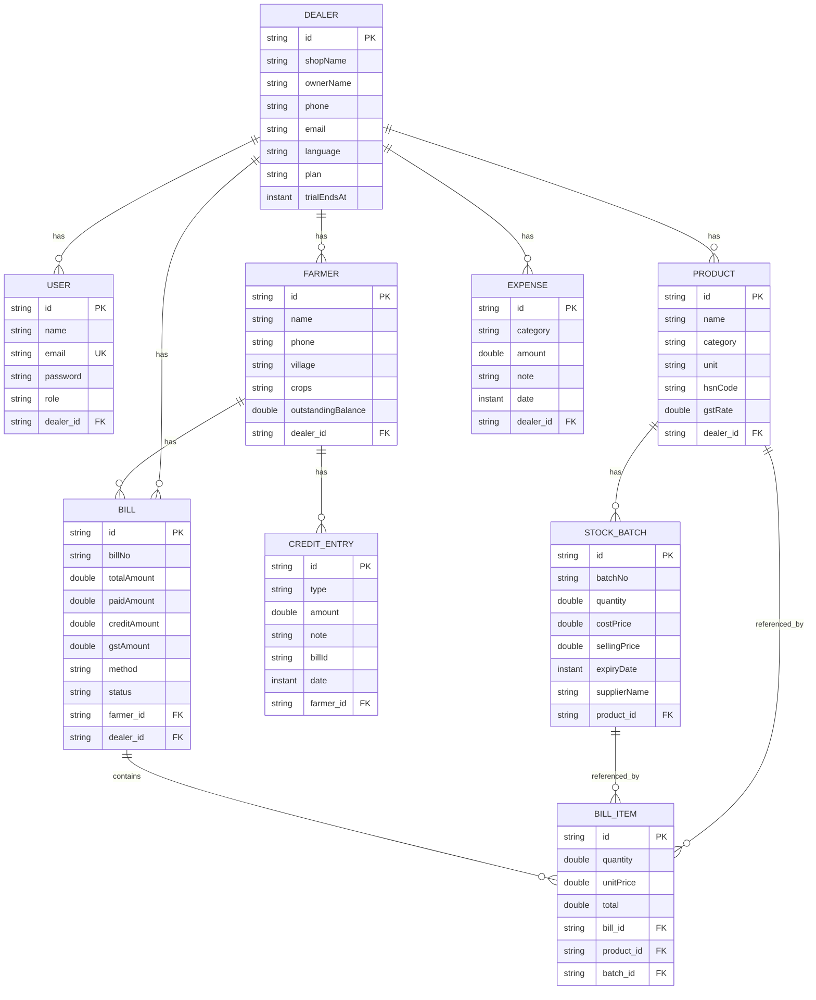
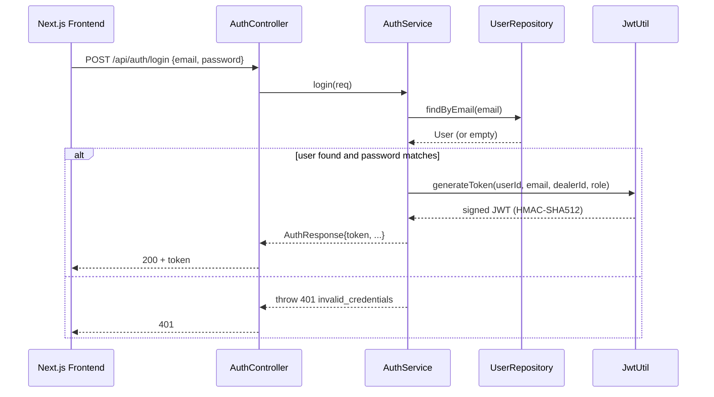
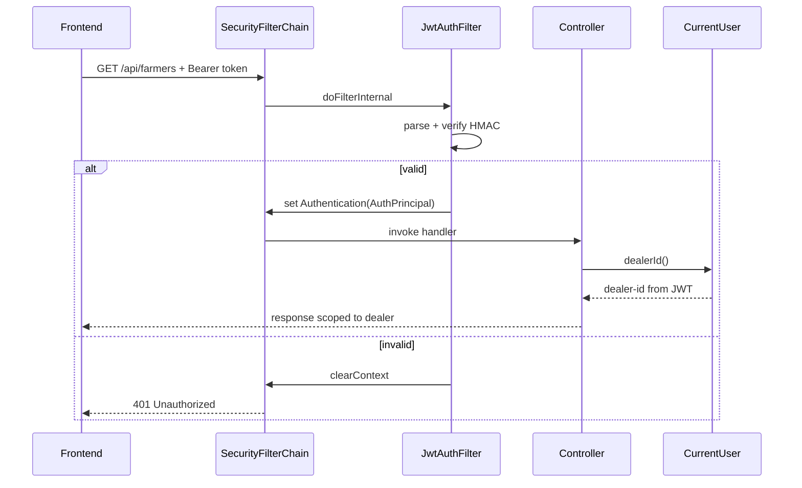
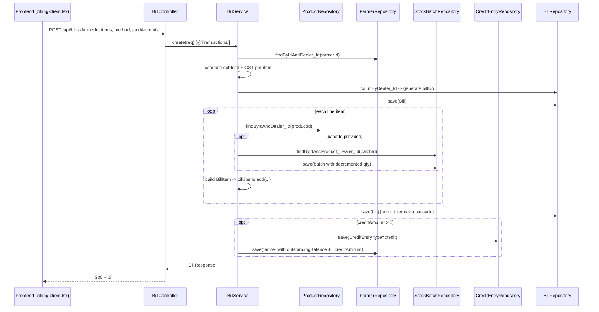
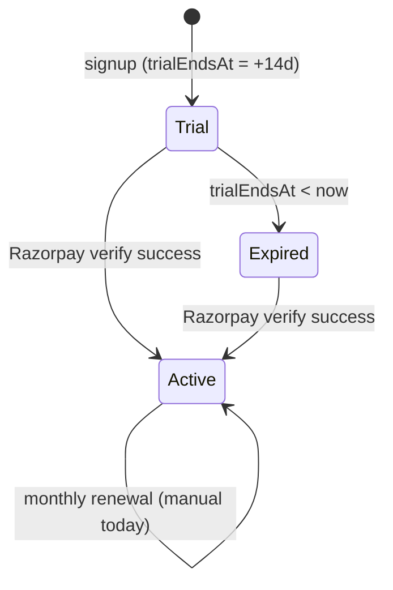
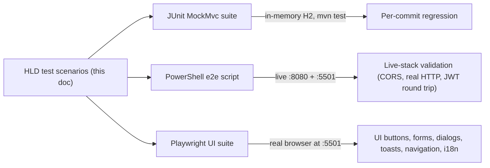
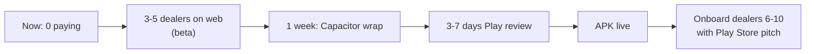
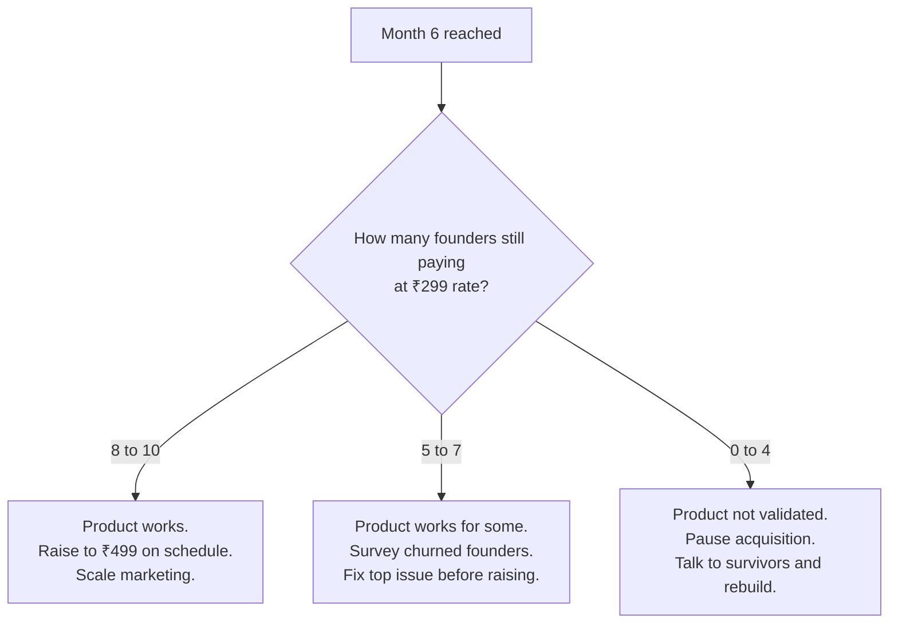

# AgriDesk — High-Level Design

**Version:** 1.0
**Date:** 2026-05-26
**Status:** Implemented MVP (Spring Boot backend + Next.js frontend)
**Scope:** `c:\trial\agridesk-api` (Spring Boot 3.4 / Java 17) and `c:\trial\agridesk-web` (Next.js 16). The legacy `c:\trial\agridesk` (full-stack Next.js) is preserved untouched as a reference implementation.

---

## 1. Context and Goals

AgriDesk is a single-tenant SaaS application that lets Indian agri-input dealers (fertilizer, pesticide, seed shop owners) manage their day-to-day shop operations from a phone or a browser.

### Primary pain point
Indian agri-input dealers extend large amounts of credit (`udhari`) to farmers, often without any system of record. Pen-and-paper or memory-based tracking leads to forgotten debts, disputes, and working-capital pressure when the dealer needs to pay suppliers.

### Target user
- Owner / staff of a small or mid-size village or town agri-input shop
- Smartphone-literate but not English-first; default language is Hindi
- One device usually shared between owner and one staff member

### Product pillars
| Pillar | What it means |
| --- | --- |
| **Premium feel at ₹499/month** | Modern UI, fast interactions, bilingual everywhere — the user must believe they are getting Tally-level value for under $6/month |
| **Mobile-first** | Same codebase serves both web and an Android wrapper via Capacitor (web frontend) |
| **Bilingual (Hindi / English)** | Every label rendered in both, with per-dealer default language preference |
| **Credit-first** | Udhari ledger is the most prominent module; everything else (billing, inventory) feeds into it |

---

## 2. System Architecture



### Why this split

| Decision | Rationale |
| --- | --- |
| Spring Boot for backend | Stronger transactional guarantees, type safety, ecosystem maturity for an inventory/ledger system; resume value for the developer |
| Next.js for frontend | Reuses the existing UI investment, mobile wrappability via Capacitor, identical UX as the legacy app |
| JWT (stateless) | No session store needed; same token works for web and Android wrapper; horizontal scaling friendly |
| H2 file in dev, PostgreSQL in prod | Zero-config local dev, drop-in swap to managed Postgres (Supabase) for production |
| Frontend as pure SPA-style client | All pages are `"use client"`, no server actions; the backend is the only source of truth |

---

## 3. Tech Stack Matrix

### Backend — `agridesk-api`
| Concern | Choice | Version |
| --- | --- | --- |
| Language / runtime | Java | 17 |
| Framework | Spring Boot | 3.4.x (parent 3.3.5 in pom) |
| Web | Spring Web (Tomcat) | bundled |
| ORM | Spring Data JPA + Hibernate | bundled |
| Security | Spring Security + BCrypt | bundled |
| JWT | jjwt-api / jjwt-impl / jjwt-jackson | 0.12.6 |
| Validation | Jakarta Bean Validation | bundled |
| DB (dev) | H2 (file-backed at `./data/agridesk`) | bundled |
| DB (prod) | PostgreSQL driver | runtime |
| Codegen | Lombok | provided/optional |
| Build | Maven | 3.9 |

### Frontend — `agridesk-web`
| Concern | Choice | Version |
| --- | --- | --- |
| Framework | Next.js (App Router, Turbopack dev) | 16.2.3 |
| Language | TypeScript | 5.x |
| UI primitives | shadcn/ui on top of `@base-ui/react` | latest |
| Styling | Tailwind CSS | 4.x |
| Icons | lucide-react | 1.8.x |
| PDF generation | jspdf | 4.2.x |
| Toasts | sonner | 2.0.x |
| Fonts | Geist + Noto Sans Devanagari (Google Fonts) | bundled via `next/font` |
| Mobile wrap | Capacitor (planned in legacy, mirrors in new) | 8.x |

---

## 4. Module Breakdown

Each backend module is a triple of `Controller` -> `Service` -> `Repository` plus DTOs. Multi-tenant isolation is enforced at the service layer using `CurrentUser.dealerId()`.

| Module | Controller | Service | Key endpoints |
| --- | --- | --- | --- |
| Auth | [AuthController.java](c:\trial\agridesk-api\src\main\java\com\agridesk\controller\AuthController.java) | [AuthService.java](c:\trial\agridesk-api\src\main\java\com\agridesk\service\AuthService.java) | `POST /api/auth/signup`, `POST /api/auth/login`, `GET /api/auth/me` |
| Farmers | [FarmerController.java](c:\trial\agridesk-api\src\main\java\com\agridesk\controller\FarmerController.java) | [FarmerService.java](c:\trial\agridesk-api\src\main\java\com\agridesk\service\FarmerService.java) | `GET/POST /api/farmers`, `PUT/DELETE /api/farmers/{id}` |
| Ledger | [LedgerController.java](c:\trial\agridesk-api\src\main\java\com\agridesk\controller\LedgerController.java) | [LedgerService.java](c:\trial\agridesk-api\src\main\java\com\agridesk\service\LedgerService.java) | `GET /api/ledger`, `POST /api/ledger/credit`, `POST /api/ledger/payment`, `DELETE /api/ledger/{id}` |
| Inventory | [InventoryController.java](c:\trial\agridesk-api\src\main\java\com\agridesk\controller\InventoryController.java) | [InventoryService.java](c:\trial\agridesk-api\src\main\java\com\agridesk\service\InventoryService.java) | `GET/POST /api/products`, `DELETE /api/products/{id}`, `POST /api/stock`, `GET /api/stock/expiring` |
| Billing | [BillController.java](c:\trial\agridesk-api\src\main\java\com\agridesk\controller\BillController.java) | [BillService.java](c:\trial\agridesk-api\src\main\java\com\agridesk\service\BillService.java) | `GET/POST /api/bills`, `DELETE /api/bills/{id}` |
| Dashboard | [DashboardController.java](c:\trial\agridesk-api\src\main\java\com\agridesk\controller\DashboardController.java) | [DashboardService.java](c:\trial\agridesk-api\src\main\java\com\agridesk\service\DashboardService.java) | `GET /api/dashboard` |
| Settings | [SettingsController.java](c:\trial\agridesk-api\src\main\java\com\agridesk\controller\SettingsController.java) | [SettingsService.java](c:\trial\agridesk-api\src\main\java\com\agridesk\service\SettingsService.java) | `GET/PUT /api/settings/dealer`, `GET/POST/DELETE /api/settings/staff` |
| Payment | [PaymentController.java](c:\trial\agridesk-api\src\main\java\com\agridesk\controller\PaymentController.java) | [PaymentService.java](c:\trial\agridesk-api\src\main\java\com\agridesk\service\PaymentService.java) | `POST /api/payment/create-order`, `POST /api/payment/verify` |

---

## 5. Data Model



### Key invariants
- Every multi-tenant entity has a non-null `dealer_id`
- `Farmer.outstandingBalance` is the materialized sum of `creditAmount` from bills + `credit` ledger entries minus `payment` ledger entries
- `Bill.totalAmount = subtotal + gstAmount`, `Bill.creditAmount = max(0, totalAmount - paidAmount)`
- `StockBatch.quantity` decrements on bill creation when `batchId` is supplied
- Cascade deletes: deleting a `Dealer` removes all owned entities; deleting a `Bill` cascades to its items but does not delete the linked `Farmer` or `Product`

---

## 6. Authentication and Authorization

### JWT issuance flow



### Claims placed in the JWT
| Claim | Source | Purpose |
| --- | --- | --- |
| `sub` | `user.email` | Standard subject |
| `userId` | `user.id` | Audit trail |
| `dealerId` | `dealer.id` | Multi-tenancy partitioning key |
| `role` | `user.role` (`owner` or `staff`) | Future RBAC |
| `iat` / `exp` | issued-at, +7 days | Standard lifetime |

### Request authentication flow



### Public vs. protected routes
Configured in [SecurityConfig.java](c:\trial\agridesk-api\src\main\java\com\agridesk\security\SecurityConfig.java):
- Public: `/api/auth/signup`, `/api/auth/login`, `/h2-console/**`, `/api/payment/webhook` (reserved)
- Protected: everything else under `/api/**`

---

## 7. Multi-Tenancy Enforcement

The application uses **service-layer enforcement** rather than database row-level security. Pattern:

1. `JwtAuthFilter` extracts `dealerId` from the verified JWT and places it on the `Authentication` principal.
2. `CurrentUser.dealerId()` reads it from `SecurityContextHolder`.
3. Every repository read uses a derived query method like `findByIdAndDealer_Id(id, dealerId)` or `findByDealer_IdOrderBy...(dealerId)`.
4. Mutations call a get-by-id-and-dealer first, throwing 404 if not found — so cross-dealer mutation attempts surface as "not found" rather than leaking existence.

This is enforced consistently in all 8 services. The test suite (see section 13) verifies it module-by-module.

---

## 8. Critical Request Lifecycle — Bill Creation



### Why this is wrapped in `@Transactional`
A failure midway (e.g., batch not found) must not leave the system with a half-created bill, an orphan credit entry, or a half-decremented stock batch. The single transactional boundary guarantees all-or-nothing semantics. The JUnit `BillControllerTest` verifies this with a deliberate-failure scenario.

---

## 9. Subscription Lifecycle



Status is computed on the frontend by [src/lib/subscription.ts](c:\trial\agridesk-web\src\lib\subscription.ts) from the `Dealer` returned by `/api/settings/dealer`. The backend stores only `plan` (`trial` / `active`) and `trialEndsAt`. The Razorpay verify endpoint atomically flips `plan` to `active` and clears `trialEndsAt`.

### Razorpay verify
```
expected = HMAC_SHA256( razorpayOrderId + "|" + razorpayPaymentId, RAZORPAY_KEY_SECRET )
if (expected.equalsIgnoreCase(razorpaySignature)) -> mark active
else -> 400 invalid_signature
```

Implemented in [PaymentService.java](c:\trial\agridesk-api\src\main\java\com\agridesk\service\PaymentService.java).

---

## 10. Deployment Topology

### Current local dev
| Component | Where | Port |
| --- | --- | --- |
| Spring Boot API | `mvn spring-boot:run` | 8080 |
| Next.js frontend | `npx next dev` | 5501 (127.0.0.1 only) |
| H2 database | `c:\trial\agridesk-api\data\agridesk.mv.db` (file) | embedded |
| H2 console | served by Spring | `/h2-console` |

### Production target (not yet deployed)
| Component | Where |
| --- | --- |
| Spring Boot API | Any JVM host (Railway, Render, Fly.io, EC2). Container-friendly fat jar via `mvn package` |
| PostgreSQL | Supabase managed Postgres (driver already on classpath) |
| Next.js frontend | Vercel (Hobby tier) |
| Android app | Capacitor wrap of the deployed frontend |
| TLS | Provider-managed (Vercel + Railway both auto-provision) |

### Environment variables required for prod
- `SPRING_DATASOURCE_URL`, `SPRING_DATASOURCE_USERNAME`, `SPRING_DATASOURCE_PASSWORD`
- `JWT_SECRET` (>= 64 bytes for HS512)
- `CORS_ORIGINS` (production domain)
- `RAZORPAY_KEY_ID`, `RAZORPAY_KEY_SECRET`
- Frontend: `NEXT_PUBLIC_API_URL` pointing at the deployed API origin

---

## 11. Non-Functional Notes

| Area | Current state | Notes / gaps |
| --- | --- | --- |
| **Security boundaries** | JWT auth + per-request `dealerId` resolution + repository-level scoping | No rate limiting; no refresh tokens (7-day fixed expiry) |
| **Transactional integrity** | `@Transactional` on every mutating service method | Default isolation (READ_COMMITTED); no optimistic locking on balance fields |
| **CORS** | Whitelist of dev origins in `application.yml`, prod overridable via `CORS_ORIGINS` | Wildcard not permitted (good); preflight tested |
| **Password storage** | BCrypt via `BCryptPasswordEncoder` | Default strength (10 rounds) |
| **Input validation** | Jakarta Validation annotations + global handler returning field errors | Covers DTOs; doesn't sanitize for XSS on the way out (JSON consumers — frontend handles escaping) |
| **Audit / observability** | Standard Spring Boot logs; H2 console available in dev | No structured logging, no metrics endpoint, no distributed tracing |
| **Backups** | H2 file is on local disk in dev | Production should rely on Supabase point-in-time recovery |
| **Idempotency** | Not enforced on POSTs | Bill creation could be made idempotent via client-supplied `Idempotency-Key` (future work) |

---

## 12. Frontend Architecture Notes

| Aspect | Implementation |
| --- | --- |
| Routing | App Router with route groups: `(auth)` for login/signup, `(dashboard)` for protected pages |
| Auth guard | [src/app/(dashboard)/layout.tsx](c:\trial\agridesk-web\src\app\(dashboard)\layout.tsx) is `"use client"`, reads session from `localStorage` on mount, redirects to `/login` if missing |
| Data fetching | All pages are client components; each module page fetches via [src/lib/api.ts](c:\trial\agridesk-web\src\lib\api.ts) on mount and stores result in `useState` |
| Mutations | Action files (e.g. `farmers/actions.ts`) are thin wrappers around the API client; pages pass an `onRefresh` callback that re-fetches after mutation |
| Token storage | `localStorage` key `agridesk.session`; cleared on logout or 401 |
| 401 handling | API client redirects to `/login` and clears session on any 401 response |
| Bilingual UX | Each label is rendered as `isHi ? labelHi : labelEn`; the language preference is part of the session and the Dealer record |

---

## 13. Test Scenario Catalog

This is the single source of truth that both the JUnit MockMvc suite and the PowerShell e2e script implement. Each row is testable.

### 13.1 Auth
| ID | Scenario | Expected |
| --- | --- | --- |
| A1 | Signup with valid payload | 200, token returned, dealer created with `plan=trial` and `trialEndsAt = now + 14d` |
| A2 | Signup with duplicate email | 409 `email_already_exists` |
| A3 | Signup with password < 6 chars | 400 validation error |
| A4 | Signup with invalid email format | 400 validation error |
| A5 | Login with correct credentials | 200, token returned |
| A6 | Login with wrong password | 401 `invalid_credentials` |
| A7 | Login with unknown email | 401 `invalid_credentials` |
| A8 | GET `/me` with valid token | 200, returns `userId`, `email`, `dealerId`, `role` |
| A9 | GET `/me` without token | 401 |

### 13.2 Farmers
| ID | Scenario | Expected |
| --- | --- | --- |
| F1 | Create farmer with name + phone | 200, returns farmer with `outstandingBalance=0` |
| F2 | Create farmer missing name | 400 validation |
| F3 | List returns only current dealer's farmers, sorted by balance desc | order correct |
| F4 | Update farmer name/phone/village/crops | 200, persisted |
| F5 | Delete farmer | 200, list no longer contains it |
| F6 | Update farmer from another dealer's token | 404 |

### 13.3 Ledger
| ID | Scenario | Expected |
| --- | --- | --- |
| L1 | Add credit ₹500 to farmer with balance 0 | balance becomes 500 |
| L2 | Add payment ₹200 | balance becomes 300 |
| L3 | Delete credit entry | balance reverts |
| L4 | Delete payment entry | balance reverts |
| L5 | List entries with date filter `from` / `to` | returns only entries in range |
| L6 | Add credit referencing another dealer's farmer | 404 |

### 13.4 Inventory
| ID | Scenario | Expected |
| --- | --- | --- |
| I1 | Create product with category + unit + gstRate | 200, persisted |
| I2 | Add stock batch with expiry 10 days from now | 200, batch persisted on product |
| I3 | GET `/api/stock/expiring` includes the 10-day batch | included |
| I4 | GET `/api/stock/expiring` excludes a 60-day batch | not included |
| I5 | GET `/api/stock/expiring` excludes a zero-quantity batch | not included |
| I6 | Delete product not in any bill | 200 |

### 13.5 Billing
| ID | Scenario | Expected |
| --- | --- | --- |
| B1 | Create bill 2 × ₹1000 with 5% GST product, paid 0 | total=2100, gst=100, credit=2100, status=`partial` |
| B2 | Same bill increments farmer's `outstandingBalance` by 2100 | balance updated |
| B3 | Same bill decrements the referenced `StockBatch.quantity` | qty reduced |
| B4 | Bill numbering increments per dealer (`B-0001`, `B-0002`) | sequential per dealer |
| B5 | Bill numbering is independent across dealers | both dealers start at `B-0001` |
| B6 | Bill with paid >= total -> status=`paid`, credit=0 | no credit entry created |
| B7 | Delete a bill with credit -> farmer balance reduces by `creditAmount` | balance reverts |
| B8 | Cross-dealer farmerId in create -> 404 | rejected |

### 13.6 Dashboard
| ID | Scenario | Expected |
| --- | --- | --- |
| D1 | Empty dealer dashboard | zeros across the board, empty lists |
| D2 | After 1 farmer + 1 bill | `totalFarmers=1`, `todaySales=billTotal`, `monthSales=billTotal` |
| D3 | `topDebtors` returns at most 5 | top 5 by balance desc |
| D4 | `recentBills` returns at most 5 | top 5 by created desc |
| D5 | Expiring stock count matches `/api/stock/expiring` length | equal |

### 13.7 Settings
| ID | Scenario | Expected |
| --- | --- | --- |
| S1 | Update dealer shopName / phone / address | 200, persisted |
| S2 | Add staff with valid payload | 200, new user with `role=staff` |
| S3 | Add staff with duplicate email | 409 |
| S4 | Remove staff (non-owner) | 200 |
| S5 | Remove owner -> 400 `cannot_remove_owner` | blocked |
| S6 | Remove staff from another dealer -> 403 | blocked |

### 13.8 Payment
| ID | Scenario | Expected |
| --- | --- | --- |
| P1 | `POST /api/payment/create-order` when `RAZORPAY_KEY_ID` empty | 503 `razorpay_not_configured` |
| P2 | `POST /api/payment/verify` with bad signature | 400 `invalid_signature` |
| P3 | `POST /api/payment/verify` with correct HMAC-SHA256 signature | 200, dealer `plan` becomes `active`, `trialEndsAt` cleared |

### 13.9 Security / Multi-Tenancy
| ID | Scenario | Expected |
| --- | --- | --- |
| SE1 | Protected endpoint without `Authorization` header | 401 |
| SE2 | Protected endpoint with tampered signature | 401 |
| SE3 | Protected endpoint with completely malformed token | 401 |
| SE4 | Dealer A's token cannot read dealer B's farmers (returns empty list scoped to A only) | isolation enforced |
| SE5 | Dealer A's token cannot delete dealer B's farmer | 404 |
| SE6 | Dealer A's token cannot delete dealer B's bill | 404 |
| SE7 | Dealer A's token cannot remove dealer B's staff | 403 |

### 13.10 CORS
| ID | Scenario | Expected |
| --- | --- | --- |
| C1 | Preflight from allowed origin `http://127.0.0.1:5501` | 200 with `Access-Control-Allow-Origin` echoed |
| C2 | Real request from allowed origin | 200, CORS header present |

---

## 14. Test Execution Topology



| Suite | Location | How to run | Catches |
| --- | --- | --- | --- |
| JUnit | `c:\trial\agridesk-api\src\test\java\com\agridesk` | `mvn test` from `c:\trial\agridesk-api` | Logic regressions, validation, transactional integrity, multi-tenant isolation |
| PowerShell e2e | `c:\trial\docs\e2e-test.ps1` | `pwsh -File c:\trial\docs\e2e-test.ps1` against a running stack | CORS preflight, real network JWT, file-DB persistence across requests, port binding |
| Playwright UI | `c:\trial\agridesk-web\tests-e2e` | `npm run test:ui` from `c:\trial\agridesk-web` against a running stack | Every clickable control, form validation, dialog flows, toasts, table updates, sidebar nav, language toggle, redirect-on-401 |

### 14.1 Playwright UI Scenario Catalog

The Playwright suite (`agridesk-web/tests-e2e`) drives a real Chromium browser
against `http://127.0.0.1:5501`. Tests use the live Spring Boot backend on
`:8080`; each test creates its own dealer (via `/api/auth/signup`) so the suite
runs sequentially against the persistent H2 file without cross-talk. Coverage:

| File | Test | What it asserts |
| --- | --- | --- |
| `auth.spec.ts` | signup happy path | Form submits → dashboard rendered |
| `auth.spec.ts` | signup with duplicate email | Toast `यह ईमेल पहले से रजिस्टर्ड है`, stays on `/signup` |
| `auth.spec.ts` | login happy path | Form submits → dashboard rendered |
| `auth.spec.ts` | login with wrong password | Toast `ईमेल या पासवर्ड गलत है`, stays on `/login` |
| `auth.spec.ts` | redirect on no session | `/dashboard` → `/login` |
| `auth.spec.ts` | logout from sidebar | Session cleared, redirected to `/login` |
| `dashboard.spec.ts` | empty dealer | Four metric cards visible; empty states for debtors + bills |
| `dashboard.spec.ts` | sidebar navigation | Every nav item routes correctly |
| `farmers.spec.ts` | add first farmer | Empty state → CTA → row appears with name + phone + village |
| `farmers.spec.ts` | edit farmer | Pencil opens dialog; name updates in table |
| `farmers.spec.ts` | delete farmer | Trash → confirm → empty state returns |
| `farmers.spec.ts` | search filter | Substring filter narrows table rows |
| `inventory.spec.ts` | create first product | Empty state → form → product card with 0 stock |
| `inventory.spec.ts` | add stock batch | Card total updates to new quantity, batch row shows sell price |
| `inventory.spec.ts` | expiring stock card | Batch expiring in 10 days appears in amber alert |
| `billing.spec.ts` | create bill | GST math (subtotal/GST/total) displayed in dialog; partial payment shows credit warning; farmer balance updates on `/dashboard/farmers` |
| `billing.spec.ts` | bill detail dialog | Items table + totals + Paid row populated |
| `billing.spec.ts` | delete bill | Row removed, empty state returns |
| `ledger.spec.ts` | credit + payment flow | Outstanding card recomputes after each entry; ledger rows show `+₹N` / `-₹N` |
| `ledger.spec.ts` | type filter | `credit`-only filter hides payment rows |
| `settings.spec.ts` | update dealer | Shop name + GSTIN persist across reload |
| `settings.spec.ts` | language toggle | Sidebar switches from Hindi to English |
| `settings.spec.ts` | add + remove staff | Staff card adds row; trash removes it |
| `settings.spec.ts` | duplicate staff email | Toast `ईमेल पहले से इस्तेमाल हो रहा है` |

Last clean run: **24 passed in ~3.4 min** (Chromium, single worker, against
`agridesk-api` on :8080 and `agridesk-web` on :5501).

---

## 15. Mobile / Android Strategy

### Why Android matters

The target audience — Indian agri-input dealers in Tier-2/Tier-3 markets — is
>90% Android, predominantly on sub-₹15k devices (Redmi 9-series, Realme C-series,
entry-level Samsung). A Play Store listing is also a non-trivial **trust signal**;
"Play Store mein hai" carries weight in a market where dealers are wary of
unknown SaaS apps. The web app works on mobile Chrome but cannot match the
trust + home-screen-icon repeat-engagement of a real APK.

### Decision matrix

Three viable paths were evaluated:

| Path | Effort | Outcome | Play Store | Rejected because |
| --- | --- | --- | --- | --- |
| **PWA only** | 1-2 days | Installable from Chrome, basic offline | No (TWA possible but indirect) | Not the trust signal we need |
| **Capacitor wrap** | ~1 week + 3-7 days Play review | Real APK from existing Next.js, single codebase | Yes | — *(chosen)* |
| **React Native / Flutter rewrite** | 4-10 weeks | Best perf, biggest UI lift | Yes | 6+ weeks for an outcome 95% indistinguishable from Capacitor |

**Decision: Capacitor wrap**, deferred until after the first 5 paying dealers
validate the product on web.

### Sequencing — Path A (validate web first, then ship app)



Rationale:

1. The first 3-5 founding dealers will be your most patient contacts (warm
   network). They can use mobile Chrome fine — a desktop-first web UI built
   responsively already covers them.
2. Two weeks of real usage will surface 5-10 small bugs / UX issues. These
   are far easier to fix in the web build and refresh-deliver vs an APK that
   has to clear Play Store review on every change.
3. By dealer 6-10, real usage signal tells you what *mobile-specific* features
   actually matter (offline mode? push notifications? barcode scan?). Without
   that data the app builds features nobody asked for.

### Capacitor wrap — work breakdown

| Day | Work |
| --- | --- |
| 1 | Add `output: 'export'` to [next.config.ts](../agridesk-web/next.config.ts); run `npm run build`; confirm `out/` is fully static. |
| 2 | `npm install @capacitor/core @capacitor/cli @capacitor/android`; `npx cap init "AgriDesk" "in.agridesk.app" --web-dir=out`; `npx cap add android`. |
| 3 | Mobile-only UX fixes — Android hardware back button (Capacitor `App` plugin), keyboard avoidance for input fields, WhatsApp deep-link via `App.openUrl()`, add `capacitor://localhost` to backend CORS. |
| 4 | Open `android/` in Android Studio; emulator run + real Redmi/Realme test of all key flows. |
| 5 | Generate signing key; build signed AAB (`./gradlew bundleRelease`); Google Play Console account ($25 one-time + KYC); upload AAB; submit listing. |
| 6-12 | Play Store review window (typically 3-7 days). Common rejection causes: missing privacy policy URL, unused permissions in `AndroidManifest.xml`, no demo account in review notes. |

### Out of scope for the Capacitor v1 APK

These are real Android features that would need additional work *after* the
first APK is live; they're not on the critical path for the first release.

| Feature | Why deferred | Trigger to add |
| --- | --- | --- |
| True offline mode (IndexedDB + sync queue) | ~3 days incremental; only ~30% of dealers will lose connectivity often enough to feel the lack | When >5 dealers report "no signal" complaints |
| FCM push notifications | ~2 days; transactional reminders are currently WhatsApp-link based | When daily app opens drop below 4/week |
| Camera barcode scanning for products | ~1 day; current product entry is text-only | When product list grows past ~50 items per dealer |
| Background sync | Rarely needed for this use case | TBD based on usage |

### Capacity at the Capacitor layer

The wrap itself adds **zero scale concerns**. Each dealer's APK runs locally;
React rendering happens on the device's CPU. Backend load per dealer is
identical to web (login, dashboard fetch, bill create, etc. — ~50-100 requests
per dealer per day). The 10,000th installed dealer's phone is no slower than
the 1st's; the backend is the only scale ceiling, sized in §13 (Deployment
Topology).

---

## 16. Beta Launch Plan and Founding Member Pricing

### Goal

Validate product-market fit with the first 10 paying dealers before opening
the public price. Specifically answer the binary question: **would 7+ of 10
founders renew at ₹499/month after the intro period?**

### Pricing structure

| Tier | Price | Cap | Lock-in |
| --- | --- | --- | --- |
| Public (website) | ₹499/month | unlimited | none — anchor stays |
| Founding Member (private, WhatsApp pitch only) | ₹299/month | first 10 dealers | 6 months, then auto-rolls to ₹499/month |
| Second wave (optional) | ₹399/month | next 10 dealers | 6 months |

Communication: Founding-Member pricing is **never on the website**; it's a
private sales tool. The site always shows ₹499 to protect the anchor.

### Activation + retention metrics

Track from Day 1 of the first dealer, written down before sign-up so the
analysis can't be retrofitted:

| Metric | Definition | Threshold for "product works" |
| --- | --- | --- |
| Activation (7-day) | Dealer creates ≥5 farmers AND ≥3 bills in first week | 8 of 10 |
| 7-day retention | Dealer opens app on ≥4 separate days in week 2 | 7 of 10 |
| Support volume | WhatsApp messages from dealer per week | sustained <3/week per dealer |
| Feature requests | Logged per dealer; top 3 across cohort = v1.1 backlog | informs roadmap |
| Month-3 conversion intent | "Would you pay ₹499 today?" asked directly | ≥7 of 10 yes |
| NPS-ish | "Would you recommend AgriDesk to another dealer?" | ≥7 of 10 yes |

### Decision tree at Month 6



### Guardrails

- **No new features during beta** unless ≥3 founders request the same one
  (single-dealer requests become weeks of distraction).
- **Hard cutoff** at 10 founders or 6 months, whichever comes first — open
  cohorts become permanent revenue ceilings.
- **Written acknowledgment** of the intro pricing (a WhatsApp screenshot
  saying "I'm joining as Founding Member ₹299/month, rolls to ₹499 after
  6 months" is sufficient).
- **Do not interpret pricing feedback during beta.** Founders are paying
  ₹299; they can't speak to whether ₹499 is "too expensive". That signal
  only exists at Month 3 with the conversion-intent question.

### Unit economics during beta

| | Month 1-6 |
| --- | ---: |
| 10 founders × ₹299 | ₹2,990/mo |
| Razorpay fees (~2%) | -₹60 |
| Render Starter + domain | -₹700 |
| **Net** | **~₹2,230/mo** |

Pre-revenue → small but real revenue, infrastructure paid for, and most
importantly: 10 real data points on product fit.

---

## 17. Known Gaps and Future Work

| Item | Why it's not done | Priority |
| --- | --- | --- |
| Refresh tokens / sliding expiry | 7-day token is acceptable for MVP; user logs in again | Low |
| Rate limiting | No bot traffic expected pre-launch | Med (before public launch) |
| Razorpay webhook handler | Endpoint reserved in `SecurityConfig`, not implemented | Med (before charging) |
| Pagination across all list endpoints | Frontend client-paginates ledger; others not expected to grow huge | Med |
| Soft deletes | Hard deletes today; would help with audit and recovery | Med |
| Idempotency keys on POST bills | Possible double-charge if network retried | Med |
| Backend i18n on error messages | Errors return string codes; frontend translates | Low |
| Frontend unit / component tests | Playwright UI suite already covers user-visible behavior end-to-end; isolated component tests deferred | Low |
| CI pipeline | `mvn test` + e2e script ready to plug into Actions or similar | Med |
| Structured logging + metrics | OK with default logs for MVP | Med (post-launch) |
| Database migrations (Flyway/Liquibase) | `ddl-auto=update` works for MVP; needs locking for prod | High (before prod) |

---

## 18. Glossary

| Term | Meaning |
| --- | --- |
| Dealer | Tenant of the system — a single agri-input shop owner |
| Udhari | Hindi for "credit extended to a customer"; the central pain point AgriDesk solves |
| Farmer | A customer of the dealer; receives credit and bills |
| Stock batch | A specific lot of a product with its own quantity, cost price, and expiry |
| Bill | A sale transaction with one or more line items; can be paid in full, partially, or fully on credit |
| Credit entry | Either a `credit` (dealer extends loan) or `payment` (farmer pays back) row in the ledger |
| GST | Goods and Services Tax — India's VAT-equivalent, configurable per product |
| Plan | Subscription state (`trial` or `active`) |
